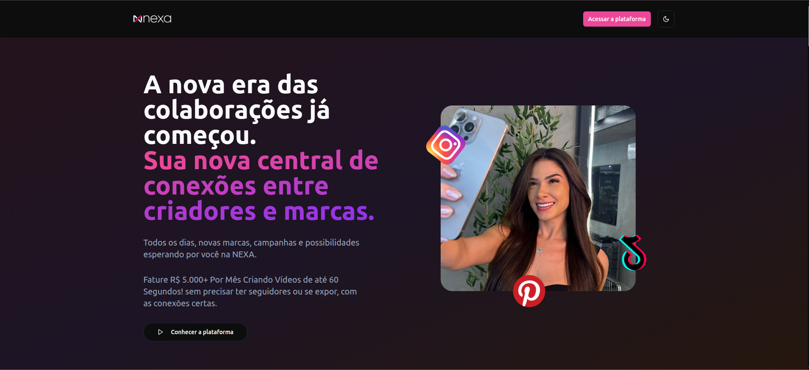

<!-- Improved compatibility of back to top link: See: https://github.com/pull/73 -->

<a name="readme-top"></a>


<!-- PROJECT LOGO -->

<br />

<div align="center">
  <a href="https://github.com/Stars1104">
    
  </a>

  <h3 align="center">Nexa</h3>

  <p align="center">
    A comprehensive platform connecting brands with creators for campaign management, featuring real-time chat, payment processing, and administrative tools.
    <br />
    <a href="https://github.com/Stars1104"><strong>Explore the docs »</strong></a>
    <br />
    <br />
    <a href="https://nexacreators.com.br">View Demo</a>
    ·
    <a href="https://github.com/Stars1104/issues">Report Bug</a>
    ·
    <a href="https://github.com/Stars1104/issues">Request Feature</a>
  </p>
</div>

<!-- TABLE OF CONTENTS -->

<details>
  <summary>Table of Contents</summary>
  <ol>
    <li>
      <a href="#about-the-project">About The Project</a>
      <ul>
        <li><a href="#built-with">Built With</a></li>
        <li><a href="#architecture">Architecture</a></li>
      </ul>
    </li>
    <li>
      <a href="#getting-started">Getting Started</a>
      <ul>
        <li><a href="#prerequisites">Prerequisites</a></li>
        <li><a href="#installation">Installation</a></li>
        <li><a href="#configuration">Configuration</a></li>
        <li><a href="#database-setup">Database Setup</a></li>
      </ul>
    </li>
    <li><a href="#usage">Usage</a></li>
    <li><a href="#running-the-application">Running The Application</a></li>
    <li><a href="#development">Development</a></li>
    <li><a href="#testing">Testing</a></li>
    <li><a href="#troubleshooting">Troubleshooting</a></li>
    <li><a href="#roadmap">Roadmap</a></li>
    <li><a href="#contributing">Contributing</a></li>
    <li><a href="#license">License</a></li>
    <li><a href="#contact">Contact</a></li>
    <li><a href="#acknowledgments">Acknowledgments</a></li>
  </ol>
</details>

<!-- ABOUT THE PROJECT -->

## About The Project

Nexa is a full-stack platform that revolutionizes the way brands connect with creators. It provides a comprehensive solution for campaign management, real-time communication, payment processing, and administrative oversight.

Here's why Nexa stands out:

* **Complete Campaign Management**: From creation to completion, manage every aspect of your campaigns
* **Real-time Communication**: Built-in chat system with Socket.IO for instant messaging
* **Secure Payment Processing**: Integrated Stripe payment system for seamless transactions
* **Multi-role Support**: Separate interfaces for Creators, Brands, Admins, and Students
* **Comprehensive Admin Tools**: Full control over users, campaigns, and platform analytics
* **Student Verification**: Special system for student creators with trial periods

Nexa simplifies the collaboration process between brands and creators, making it easier than ever to find the right match and manage successful campaigns.

<p align="right">(<a href="#readme-top">back to top</a>)</p>

### Built With

This section lists the major frameworks and libraries used to build the Nexa platform.

[![Laravel][Laravel.com]][Laravel-url] [![React][React.js]][React-url] [![TypeScript][TypeScript]][TypeScript-url] [![Vite][Vite]][Vite-url] [![TailwindCSS][TailwindCSS]][TailwindCSS-url] [![Redux][Redux]][Redux-url] [![Socket.IO][Socket.IO]][Socket.IO-url] [![Stripe][Stripe]][Stripe-url]

<p align="right">(<a href="#readme-top">back to top</a>)</p>

### Architecture

```
Serve/
├── Nexa-Backend/          # Laravel API
│   ├── app/               # Application logic
│   ├── database/          # Migrations & seeders
│   ├── routes/            # API routes
│   └── socket-server.js   # Socket.IO server
│
└── Nexa-Frontend/         # React application
    ├── src/
    │   ├── api/           # API clients
    │   ├── components/    # React components
    │   ├── pages/         # Page components
    │   └── store/         # Redux store
    └── public/            # Static assets
```

<p align="right">(<a href="#readme-top">back to top</a>)</p>

<!-- GETTING STARTED -->

## Getting Started

This section will guide you through setting up the Nexa platform locally on your machine.

### Prerequisites

Before you begin, ensure you have the following software installed:

* **PHP** >= 8.1 with extensions:
  - BCMath, Ctype, Fileinfo, JSON, Mbstring, OpenSSL, PDO, Tokenizer, XML
* **Composer** >= 2.0
  ```sh
  composer --version
  ```
* **Node.js** >= 18.x and npm >= 9.x
  ```sh
  node --version
  npm --version
  ```
* **MySQL** >= 8.0 or **PostgreSQL** >= 13
* **Redis** (for caching and queues)

### Installation

Follow these steps to install and set up the Nexa platform:

1. **Clone the repository**
   ```sh
   git clone https://github.com/your_username/nexa-platform.git
   cd nexa-platform
   ```

2. **Backend Setup**
   ```sh
   cd Nexa-Backend
   composer install
   cp .env.example .env
   php artisan key:generate
   php artisan storage:link
   php artisan storage:setup-directories
   ```

3. **Frontend Setup**
   ```sh
   cd ../Nexa-Frontend
   npm install
   ```

4. **Socket Server Setup**
   ```sh
   cd ../Nexa-Backend
   npm install
   ```

5. **Configure Environment Variables** (see Configuration section below)

<p align="right">(<a href="#readme-top">back to top</a>)</p>

### Configuration

#### Backend Environment Variables

Edit `Nexa-Backend/.env` with the following variables:

```env
# Application
APP_NAME="Nexa Platform"
APP_ENV=local
APP_KEY=base64:... # Generated by php artisan key:generate
APP_DEBUG=true
APP_URL=http://localhost:8000
APP_TIMEZONE=UTC

# Database
DB_CONNECTION=mysql
DB_HOST=127.0.0.1
DB_PORT=3306
DB_DATABASE=nexa_db
DB_USERNAME=root
DB_PASSWORD=

# Redis
REDIS_HOST=127.0.0.1
REDIS_PASSWORD=null
REDIS_PORT=6379

# Mail (AWS SES)
MAIL_MAILER=ses
MAIL_FROM_ADDRESS=noreply@nexacreators.com.br
MAIL_FROM_NAME="${APP_NAME}"

# AWS Configuration
AWS_ACCESS_KEY_ID=your_aws_access_key
AWS_SECRET_ACCESS_KEY=your_aws_secret_key
AWS_DEFAULT_REGION=us-east-1
AWS_SES_REGION=us-east-1

# Stripe
STRIPE_SECRET=sk_test_your_stripe_secret_key
STRIPE_PUBLISHABLE_KEY=pk_test_your_stripe_publishable_key
STRIPE_WEBHOOK_SECRET=whsec_your_webhook_secret

# Session & Cache
SESSION_DRIVER=redis
CACHE_DRIVER=redis
QUEUE_CONNECTION=redis

# Sanctum
SANCTUM_STATEFUL_DOMAINS=localhost:5173,localhost:3000
SESSION_DOMAIN=localhost
```

#### Frontend Environment Variables

Create `Nexa-Frontend/.env`:

```env
# Backend API URL
VITE_BACKEND_URL=http://localhost:8000

# Socket.IO Server URL
VITE_SOCKET_URL=http://localhost:3001

# Stripe Publishable Key
VITE_STRIPE_PUBLISHABLE_KEY=pk_test_your_stripe_publishable_key
```

<p align="right">(<a href="#readme-top">back to top</a>)</p>

### Database Setup

1. **Create the database:**
   ```sql
   CREATE DATABASE nexa_db CHARACTER SET utf8mb4 COLLATE utf8mb4_unicode_ci;
   ```

2. **Run migrations:**
   ```sh
   cd Nexa-Backend
   php artisan migrate
   ```

3. **Seed the database (optional):**
   ```sh
   php artisan db:seed
   ```

<p align="right">(<a href="#readme-top">back to top</a>)</p>

<!-- USAGE EXAMPLES -->

## Usage

Nexa provides different interfaces based on user roles:

### For Creators
- Browse and apply to campaigns
- Manage portfolio and showcase work
- Chat with brands in real-time
- Track earnings and request withdrawals
- Manage subscription and payment methods

### For Brands
- Create and manage campaigns
- Search and connect with creators
- Real-time chat with creators
- Manage contracts and payments
- Track campaign performance

### For Admins
- Dashboard with platform metrics
- User management (Creators, Brands, Students)
- Campaign approval and moderation
- Guide management
- Brand rankings and analytics
- Withdrawal verification

### For Students
- Student verification system
- Limited creator features
- Trial period management

_For more detailed documentation, please refer to the [Documentation](https://github.com/your_username/nexa-platform/wiki)_

<p align="right">(<a href="#readme-top">back to top</a>)</p>

<!-- RUNNING THE APPLICATION -->

## Running The Application

### Development Mode

1. **Start the Laravel backend:**
   ```sh
   cd Nexa-Backend
   php artisan serve
   ```
   Backend will be available at `http://localhost:8000`

2. **Start the Socket.IO server:**
   ```sh
   cd Nexa-Backend
   npm run dev
   ```
   Socket server will run on `http://localhost:3001`

3. **Start the React frontend:**
   ```sh
   cd Nexa-Frontend
   npm run dev
   ```
   Frontend will be available at `http://localhost:5173`

### Production Mode

1. **Build the frontend:**
   ```sh
   cd Nexa-Frontend
   npm run build
   ```

2. **Optimize Laravel:**
   ```sh
   cd Nexa-Backend
   php artisan config:cache
   php artisan route:cache
   php artisan view:cache
   ```

3. **Set up process manager (PM2) for Socket.IO:**
   ```sh
   cd Nexa-Backend
   pm2 start socket-server.js --name nexa-socket
   pm2 save
   pm2 startup
   ```

<p align="right">(<a href="#readme-top">back to top</a>)</p>

<!-- DEVELOPMENT -->

## Development

### Backend Commands

```bash
# Run migrations
php artisan migrate

# Rollback migrations
php artisan migrate:rollback

# Create a new migration
php artisan make:migration create_table_name

# Run seeders
php artisan db:seed

# Clear cache
php artisan cache:clear
php artisan config:clear
php artisan route:clear

# Generate IDE helper
php artisan ide-helper:generate
```

### Frontend Commands

```bash
# Start development server
npm run dev

# Build for production
npm run build

# Preview production build
npm run preview

# Run linter
npm run lint

# Run tests
npm test
```

<p align="right">(<a href="#readme-top">back to top</a>)</p>

<!-- TESTING -->

## Testing

### Backend Tests

```bash
cd Nexa-Backend
php artisan test
```

### Frontend Tests

```bash
cd Nexa-Frontend
npm test
```

<p align="right">(<a href="#readme-top">back to top</a>)</p>

<!-- TROUBLESHOOTING -->

## Troubleshooting

### Common Issues

1. **Storage link not working:**
   ```bash
   php artisan storage:link
   ```

2. **Permission errors:**
   ```bash
   chmod -R 775 storage bootstrap/cache
   chown -R www-data:www-data storage bootstrap/cache
   ```

3. **Composer memory limit:**
   ```bash
   COMPOSER_MEMORY_LIMIT=-1 composer install
   ```

4. **Socket.IO connection issues:**
   - Check CORS configuration in `socket-server.js`
   - Verify Socket.IO server is running
   - Check firewall settings

5. **Database connection errors:**
   - Verify database credentials in `.env`
   - Ensure database exists
   - Check MySQL/PostgreSQL service is running

6. **Frontend build errors:**
   ```bash
   rm -rf node_modules package-lock.json
   npm install
   ```

### Logs

- **Laravel logs:** `Nexa-Backend/storage/logs/laravel.log`
- **Socket.IO logs:** Check console output or PM2 logs
- **Frontend errors:** Check browser console

<p align="right">(<a href="#readme-top">back to top</a>)</p>

<!-- ROADMAP -->

## Roadmap

- [x] User authentication and authorization
- [x] Campaign management system
- [x] Real-time chat functionality
- [x] Payment processing integration
- [x] Admin dashboard
- [x] Student verification system

See the [open issues](https://github.com/Stars1104/issues) for a full list of proposed features (and known issues).

<p align="right">(<a href="#readme-top">back to top</a>)</p>

<!-- CONTRIBUTING -->

## Contributing

Contributions are what make the open source community such an amazing place to learn, inspire, and create. Any contributions you make are **greatly appreciated**.

If you have a suggestion that would make this better, please fork the repo and create a pull request. You can also simply open an issue with the tag "enhancement".
Don't forget to give the project a star! Thanks again!

1. Fork the Project
2. Create your Feature Branch (`git checkout -b feature/AmazingFeature`)
3. Commit your Changes (`git commit -m 'Add some AmazingFeature'`)
4. Push to the Branch (`git push origin feature/AmazingFeature`)
5. Open a Pull Request

<p align="right">(<a href="#readme-top">back to top</a>)</p>

<!-- LICENSE -->

## License

Distributed under the MIT License. See `LICENSE.txt` for more information.

<p align="right">(<a href="#readme-top">back to top</a>)</p>

<!-- CONTACT -->

## Contact

Nexa Team - [@nexacreators](https://twitter.com/nexacreators) - support@nexacreators.com.br

Project Link: [https://https://github.com/Stars1104](https://github.com/Stars1104/)

<p align="right">(<a href="#readme-top">back to top</a>)</p>

<!-- ACKNOWLEDGMENTS -->

## Acknowledgments

Use this space to list resources you find helpful and would like to give credit to. I've included a few of my favorites to kick things off!

* [Laravel Documentation](https://laravel.com/docs)
* [React Documentation](https://react.dev)
* [Tailwind CSS](https://tailwindcss.com)
* [shadcn/ui](https://ui.shadcn.com)
* [Stripe Documentation](https://stripe.com/docs)
* [Socket.IO Documentation](https://socket.io/docs)
* [Choose an Open Source License](https://choosealicense.com)
* [GitHub Emoji Cheat Sheet](https://www.webpagefx.com/tools/emoji-cheat-sheet)
* [Img Shields](https://shields.io)
* [GitHub Pages](https://pages.github.com)

<p align="right">(<a href="#readme-top">back to top</a>)</p>

<!-- MARKDOWN LINKS & IMAGES -->
<!-- https://www.markdownguide.org/basic-syntax/#reference-style-links -->

[contributors-shield]: https://img.shields.io/github/contributors/your_username/nexa-platform.svg?style=for-the-badge
[contributors-url]: https://github.com/your_username/nexa-platform/graphs/contributors
[forks-shield]: https://img.shields.io/github/forks/your_username/nexa-platform.svg?style=for-the-badge
[forks-url]: https://github.com/your_username/nexa-platform/network/members
[stars-shield]: https://img.shields.io/github/stars/your_username/nexa-platform.svg?style=for-the-badge
[stars-url]: https://github.com/your_username/nexa-platform/stargazers
[issues-shield]: https://img.shields.io/github/issues/your_username/nexa-platform.svg?style=for-the-badge
[issues-url]: https://github.com/your_username/nexa-platform/issues
[license-shield]: https://img.shields.io/github/license/your_username/nexa-platform.svg?style=for-the-badge
[license-url]: https://github.com/your_username/nexa-platform/blob/master/LICENSE.txt
[linkedin-shield]: https://img.shields.io/badge/-LinkedIn-black.svg?style=for-the-badge&logo=linkedin&colorB=555
[linkedin-url]: https://linkedin.com/in/nexa-platform

[Laravel.com]: https://img.shields.io/badge/Laravel-FF2D20?style=for-the-badge&logo=laravel&logoColor=white
[Laravel-url]: https://laravel.com
[React.js]: https://img.shields.io/badge/React-20232A?style=for-the-badge&logo=react&logoColor=61DAFB
[React-url]: https://reactjs.org/
[TypeScript]: https://img.shields.io/badge/TypeScript-007ACC?style=for-the-badge&logo=typescript&logoColor=white
[TypeScript-url]: https://www.typescriptlang.org/
[Vite]: https://img.shields.io/badge/Vite-646CFF?style=for-the-badge&logo=vite&logoColor=white
[Vite-url]: https://vitejs.dev/
[TailwindCSS]: https://img.shields.io/badge/Tailwind_CSS-38B2AC?style=for-the-badge&logo=tailwind-css&logoColor=white
[TailwindCSS-url]: https://tailwindcss.com/
[Redux]: https://img.shields.io/badge/Redux-593D88?style=for-the-badge&logo=redux&logoColor=white
[Redux-url]: https://redux.js.org/
[Socket.IO]: https://img.shields.io/badge/Socket.io-010101?style=for-the-badge&logo=socket.io&logoColor=white
[Socket.IO-url]: https://socket.io/
[Stripe]: https://img.shields.io/badge/Stripe-626CD9?style=for-the-badge&logo=Stripe&logoColor=white
[Stripe-url]: https://stripe.com/
[MySQL]: https://img.shields.io/badge/MySQL-4479A1?style=for-the-badge&logo=mysql&logoColor=white
[MySQL-url]: https://www.mysql.com/
[Redis]: https://img.shields.io/badge/Redis-DC382D?style=for-the-badge&logo=redis&logoColor=white
[Redis-url]: https://redis.io/
